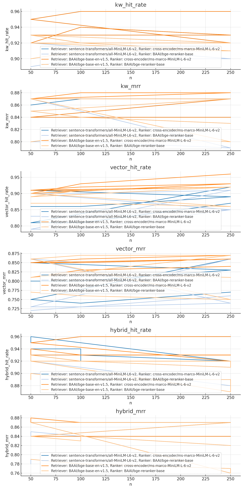

# Hyperparameter evaluations on Modal

## Context

The [evaluate.py](./evaluate.py) script is a utility script that does a hyperparameter sweep along the axes of embedding models, re-ranking models, chunk size, alpha and limit values. Because the combination of parameters create 108 configurations, testing on a single GPU was too slow. These are the parameters that I am testing by default:

```{python}
EMBEDDING_MODELS = [
    "sentence-transformers/all-MiniLM-L6-v2",  # Baseline for the course
    "BAAI/bge-base-en-v1.5",  # Higher ranked model on the MTEB
]
RERANKER_MODELS = [
    "cross-encoder/ms-marco-MiniLM-L-6-v2",  # Baseline for the course
    "BAAI/bge-reranker-base",  # Higher ranked model on the MTEB
]
CHUNK_SIZES = [128, 256, 512]
LIMITS = [50, 100, 250, 500]
ALPHAS = [0.25, 0.5, 0.75]
```

And here's what they mean:
* `EMBEDDING_MODELS`: These are the base embedding models used by our retriever.
* `RERANKER_MODELS`: These are the models used by our reranker post retrival.
* `CHUNK_SIZES`: Determines what sizes we chunk our input tokens to.
* `LIMITS`: The number of documents retrieved from the retriever. The bigger this gets, slower the re-ranker will be.
* `ALPHAS`: The ratio of keyword search and vector search to use as part of hybrid search.

This script does this in a parallelized way using [Modal](https://modal.com/) and writes the final evaluation metrics to the local `eval_results/` directory. The script will create the directory if it doesn't exist and this directory by default is ignored by git.

This script assumes that you have the corresponding [Weaviate](https://weaviate.io/) collections. If the collection doesn't exist, the search is skipped and an empty dictionary is returned for the evaluation. If you want to see how these collections are created see the final optional section of [this notebook](../../../notebooks/3-Retrieval_Evaluation_Week1.ipynb).

## Running the script

If you have installed the dependencies found in [requirements.txt](../../../requirements.txt), you should be all set to run the script.

Once you create a Modal account and you can authenticate with: `python -m modal setup`. For more detailed instructions, check out [Modal's documentation page](https://modal.com/docs/examples/hello_world).

From the root of the repository run: `modal run src/evaluation/modal/evaluate.py`. This will kick off a series of jobs. Final metrics will be written to the local `eval_results/` directory as a CSV.

## Results

Here's a summary of the results:
* Chunk size of 128 is too small to produce high-quality results.
* Re-ranker + hybrid search is able to bridge the gap between base models but has a pretty high latency cost.
* The best performing combination is using the `BAAI/bge-base-en-v1.5` embedding model, `cross-encoder/ms-marco-MiniLM-L-6-v2` re-ranker model with a chunk size of 512, a N of 250 and an alpha of 0.5 or 0.75.
* This is inline with the experimentation I have done in week 1. The same model with a chunk size of 512 performed the best in that evaluation.
* However, this model could be too slow for our use case, once we combine it with the LLM step.
* And further inspection suggests the base model we used (`sentence-transformers/all-MiniLM-L6-v2`) is able to achieve the highest hybrid MRR while being much faster using an alpha of 0.5 or 0.75 with a chunk size of 512, N of 50.
* In summary, my parameters going forward will be:
  * Embedding model: `sentence-transformers/all-MiniLM-L6-v2`
  * Re-ranker model: `cross-encoder/ms-marco-MiniLM-L-6-v2`
  * N: 50
  * Alpha: 0.5
  * Chunk size: 512
  * Collection name: `Huberman_all_minilm_l6_v2_512`
* If speed ends up not being a problem, more future-proof parameters could be:
  * Embedding model: `BAAI/bge-base-en-v1.5`
  * Re-ranker model: `cross-encoder/ms-marco-MiniLM-L-6-v2`
  * N: 250
  * Alpha: 0.5
  * Chunk size: 512
  * Collection name: `Huberman_bge_base_en_v15_512`

Not the prettiest visualization, but here's a figure for a rough idea of the parameters:


## Cost

Using 10 T4 GPUs in parallel, this job cost ~$25.
